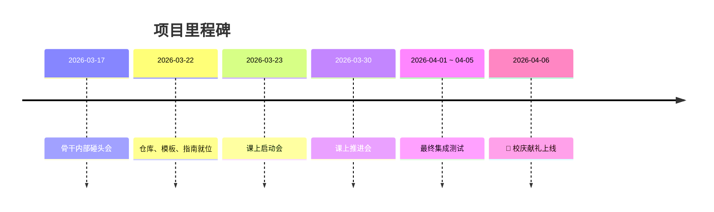

# 关于本项目

## 📖 项目背景

电力系统是现代社会运转的基石。然而，历史上多次大规模停电事故表明，即使是最先进的电力系统也可能发生灾难性故障。深入分析这些事故，总结经验教训，对于预防未来类似事故具有重要意义。

本项目由上海交通大学电力系统安全研究团队发起，旨在建设电力系统安全分析领域的权威中文知识平台，作为上海交通大学 130 周年校庆献礼。

---

## 🎯 项目目标

> **做电力系统安全分析方向最好的中文网站——让每一个做这个方向的人，第一个想到的就是这个网站。**

### 核心价值

- **内容为本**：网站只是载体，高质量内容才是核心
- **质量优先**：宁缺毋滥，每个案例都经过严格审核
- **荣誉传承**：每位贡献者署名永久保留
- **学术 IP**：打造交大在电力安全分析领域的品牌影响力

---

## 👥 团队介绍

### 项目负责人

孟宇航 - 架构设计、标准制定

### 核心团队

=== "组织组"

    负责任务协调、进度跟踪、贡献记录
    
    - 王湘
    - 滨程
    - ...

=== "技术组"

    负责仓库搭建、CI/CD、代码审查、模板维护
    
    - 晨辉
    - 民康
    - 广绪
    - ...

=== "内容组"

    负责事故主题规划、内容规范、质量评审
    
    - 睿丞
    - 志震
    - ...

=== "宣传组"

    负责推广宣传、公众号运营、SEO优化
    
    - ...

---

## 🏆 贡献者名录

感谢所有为本项目做出贡献的同学！

!!! note "贡献者署名永久保留"
    每位贡献者的付出都将被铭记，署名将永久保留在项目中。

| 贡献者 | 贡献内容 | 完成时间 |
|--------|----------|----------|
| [示范] | 2003年美加大停电 | 2026-03 |
| ... | ... | ... |

---

## 📅 项目历程

---

## 📜 许可协议

本项目采用 [CC BY-NC-SA 4.0](https://creativecommons.org/licenses/by-nc-sa/4.0/deed.zh) 知识共享许可协议。

**您可以自由地：**

- **分享** — 在任何媒介以任何形式复制、发行本作品
- **演绎** — 修改、转换或以本作品为基础进行创作

**惟须遵守下列条件：**

- **署名** — 您必须给出适当的署名，提供指向本许可协议的链接
- **非商业性使用** — 您不得将本作品用于商业目的
- **相同方式共享** — 如果您再混合、转换或者基于本作品进行创作，您必须基于与原先许可协议相同的许可协议分发您贡献的作品

---

## 🔗 联系方式

- **项目仓库**：[Gitee](https://gitee.com/ch_su/power-safety-wiki)
- **公众号**：「AI的尽头是电力」
- **反馈建议**：[提交 Issue](https://gitee.com/ch_su/power-safety-wiki/issues)

---

## 🙏 致谢

- 感谢上海交通大学对本项目的支持
- 感谢所有贡献者的辛勤付出
- 感谢开源社区提供的优秀工具（MkDocs、Material 主题等）

---

  
  

    献礼上海交通大学 130 周年校庆 
    2026年4月6日
  

