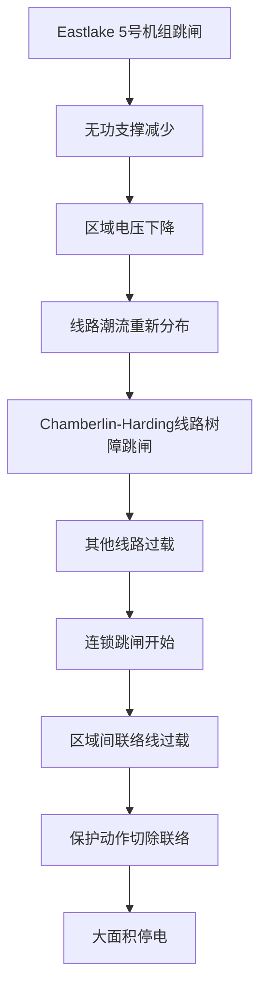

# 2003年美加大停电

!!! info "事故概况"
    | 项目 | 内容 |
    |------|------|
    | **发生时间** | 2003年8月14日 16:10 (东部时间) |
    | **影响地区** | 美国东北部、中西部及加拿大安大略省 |
    | **停电规模** | 约5500万人受影响 |
    | **停电时长** | 最长达4天 |
    | **经济损失** | 约60亿美元 |

---

## 一、事故概况

### 1.1 事故背景

2003年8月14日下午，美国东北部和中西部以及加拿大安大略省发生了北美历史上最大规模的停电事故。事故发生前，电网处于夏季高负荷运行状态，气温较高，空调负荷巨大。

### 1.2 事故经过

| 时间 (EDT) | 事件 |
|------------|------|
| 13:31 | FirstEnergy 的 Eastlake 5 号机组因过热跳闸 |
| 14:02 | Chamberlin-Harding 345kV 线路因树障接地故障跳闸 |
| 15:05 | Hanna-Juniper 345kV 线路过载跳闸 |
| 15:32 | Star-South Canton 345kV 线路过载跳闸 |
| 15:41 | 连锁故障开始，多条线路相继跳闸 |
| 16:10 | 大规模停电发生，3分钟内失去61,800MW负荷 |

### 1.3 影响范围

停电影响了美国8个州（俄亥俄、密歇根、宾夕法尼亚、纽约、佛蒙特、马萨诸塞、康涅狄格、新泽西）和加拿大安大略省的大部分地区。

主要影响：
- 纽约市地铁系统全面瘫痪，40万人被困
- 机场关闭，数千航班取消
- 通讯系统严重中断
- 约有100人因事故相关原因死亡

---

## 二、原因分析

### 2.1 直接原因（技术原因）

!!! warning "关键故障点"
    FirstEnergy 公司调度中心的能量管理系统（EMS）报警功能失效，导致调度员未能及时发现线路过载情况。

**主要技术原因：**

1. **软件缺陷**：FirstEnergy 的 EMS 系统存在软件漏洞，导致报警和状态估计功能失效超过1小时
2. **树障管理不当**：多条输电线路因树木生长过高导致接地故障
3. **无功功率不足**：区域内无功功率储备不足，电压持续下降

### 2.2 间接原因（管理原因）

1. **态势感知缺失**：调度员对系统实际运行状态缺乏准确认知
2. **通讯不畅**：FirstEnergy 与相邻控制区之间缺乏有效沟通
3. **培训不足**：调度员应对紧急情况的能力不足
4. **监管漏洞**：可靠性标准缺乏强制性

### 2.3 连锁反应机理

---

## 三、AI 辅助分析

### 3.1 视频解读

<!-- B站视频示例 -->

  <iframe 
    src="//player.bilibili.com/player.html?bvid=BV1xx411x7xx&page=1" 
    scrolling="no" 
    border="0" 
    frameborder="no" 
    framespacing="0" 
    allowfullscreen="true">
  </iframe>

*注：以上为示例嵌入代码，实际视频 BV 号待补充*

### 3.2 关键数据

事故发展过程中的负荷损失曲线：

| 阶段 | 时间 | 累计损失负荷 |
|------|------|--------------|
| 初期 | 15:41-16:05 | 约 3,500 MW |
| 崩溃 | 16:05-16:10 | 61,800 MW |
| 稳定 | 16:10 后 | 持续停电 |

---

## 四、经验与启示

### 4.1 技术层面

- **加强态势感知**：部署先进的能量管理系统，确保实时监控能力
- **强化树障管理**：建立严格的输电通道维护标准
- **提升无功储备**：保证足够的动态无功补偿能力
- **完善保护协调**：优化继电保护定值，避免连锁跳闸

### 4.2 管理层面

- **强制可靠性标准**：事故后 NERC 标准从自愿遵守变为强制执行
- **改进跨区协调**：建立更有效的控制区间信息共享机制
- **加强人员培训**：定期开展应急演练和仿真培训
- **完善报警系统**：确保关键报警功能的可靠性和冗余度

### 4.3 对我国电网的借鉴意义

1. **重视软件系统可靠性**：调度自动化系统是电网安全运行的关键
2. **加强跨区协调机制**：随着特高压互联，区域间协调愈发重要
3. **完善应急预案**：大停电后的快速恢复能力是系统韧性的重要体现
4. **强化责任制**：明确各级调度的安全责任边界

---

## 五、参考文献

1. U.S.-Canada Power System Outage Task Force. [Final Report on the August 14, 2003 Blackout in the United States and Canada: Causes and Recommendations](https://www.energy.gov/sites/default/files/oeprod/DocumentsandMedia/BlackoutFinal-Web.pdf)[R]. 2004.

2. NERC. [Technical Analysis of the August 14, 2003, Blackout: What Happened, Why, and What Did We Learn?](https://www.nerc.com/docs/docs/blackout/NERC_Final_Blackout_Report_07_13_04.pdf)[R]. 2004.

3. 薛禹胜. 综合防御由偶然故障演化为电力灾难——北美"8·14"大停电的警示[J]. 电力系统自动化, 2003, 27(18): 1-5.

4. 印永华, 郭剑波, 赵建军. 美加联合电网大面积停电事故分析及启示[J]. 电网技术, 2003, 27(10): 8-11.

---

!!! note "贡献者信息"
    - **页面作者**: [示范页面]
    - **初稿完成**: 2026-03-17
    - **最后更新**: 2026-03-17
    - **审核状态**: ✅ 已通过（示范）
