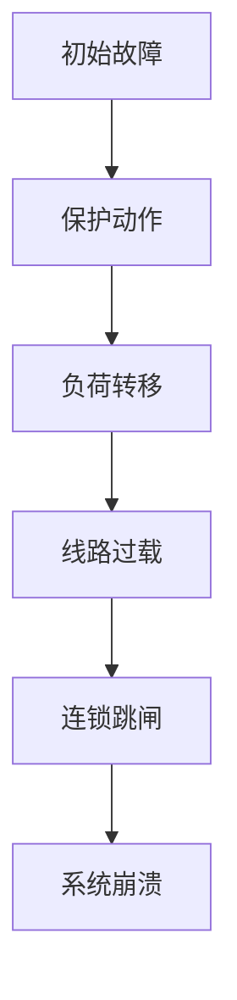

# [年份] [地区]大停电

!!! info "事故概况"
    | 项目 | 内容 |
    |------|------|
    | **发生时间** | YYYY年MM月DD日 HH:MM (当地时间) |
    | **影响地区** | [具体地区，如：美国东北部、加拿大安大略省] |
    | **停电规模** | [受影响人口数量，如：5500万人] |
    | **停电时长** | [最长停电时间，如：最长达4天] |
    | **经济损失** | [估计损失，如：约60亿美元] |

---

## 一、事故概况

### 1.1 事故背景

[描述事故发生前的电网状态、天气条件、负荷水平等背景信息]

### 1.2 事故经过

[按时间线描述事故发展过程，建议使用时间轴形式]

| 时间 | 事件 |
|------|------|
| HH:MM | [事件1] |
| HH:MM | [事件2] |
| HH:MM | [事件3] |

### 1.3 影响范围

[描述停电影响的地理范围、受影响人口、关键基础设施等]

---

## 二、原因分析

### 2.1 直接原因（技术原因）

!!! warning "关键故障点"
    [简要概括最关键的技术故障]

[详细描述导致事故的直接技术原因，如设备故障、保护误动等]

### 2.2 间接原因（管理原因）

[描述管理层面的问题，如调度失误、信息沟通不畅、培训不足等]

### 2.3 连锁反应机理

[分析事故如何从局部故障演变为大面积停电的连锁过程]

---

## 三、AI 辅助分析

### 3.1 视频解读

<!-- AI 视频嵌入模板 - 请勿修改结构，只需替换 VIDEO_ID -->

  <iframe 
    src="https://www.youtube.com/embed/VIDEO_ID" 
    title="AI 辅助分析视频"
    frameborder="0" 
    allow="accelerometer; autoplay; clipboard-write; encrypted-media; gyroscope; picture-in-picture" 
    allowfullscreen>
  </iframe>

<!-- 如果使用 B站，请使用以下模板 -->
<!--

  <iframe 
    src="//player.bilibili.com/player.html?bvid=BV_ID&page=1" 
    scrolling="no" 
    border="0" 
    frameborder="no" 
    framespacing="0" 
    allowfullscreen="true">
  </iframe>

-->

### 3.2 关键数据可视化

[如有数据图表，可在此处插入]

---

## 四、经验与启示

### 4.1 技术层面

- [启示1：如加强继电保护协调]
- [启示2：如提升态势感知能力]
- [启示3：如完善黑启动方案]

### 4.2 管理层面

- [启示1：如加强跨区域协调机制]
- [启示2：如完善应急预案演练]
- [启示3：如强化人员培训]

### 4.3 对我国电网的借鉴意义

[结合我国电网实际情况，分析该事故对我国电力系统安全运行的启示]

---

## 五、参考文献

1. [作者. 文献标题[J]. 期刊名, 年份, 卷(期): 页码.](链接)
2. [官方调查报告名称](报告链接)
3. [其他参考资料](链接)

---

!!! note "贡献者信息"
    - **页面作者**: [昵称/学号缩写]
    - **初稿完成**: YYYY-MM-DD
    - **最后更新**: YYYY-MM-DD
    - **审核状态**: 待审核 / 已通过

<!-- 
===========================================
📌 模板使用说明（发布前请删除此注释块）
===========================================

1. 复制本模板，重命名为 index.md，放入对应事故目录
2. 替换所有 [方括号内容] 为实际内容
3. 时间、数据务必核实，标注来源
4. AI 视频：替换 VIDEO_ID 或 BV_ID
5. Mermaid 流程图可根据实际情况修改
6. 参考文献至少 3 条，优先使用官方报告
7. 完成后更新贡献者信息区域

质量检查清单：
□ 事故概况信息框完整
□ 时间线准确清晰
□ 原因分析层次分明
□ AI 视频可正常播放
□ 参考文献格式规范
□ 无错别字和语法错误
===========================================
-->
